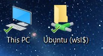
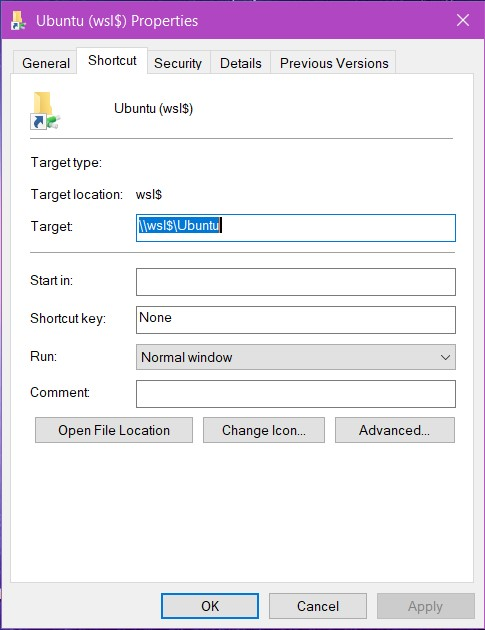
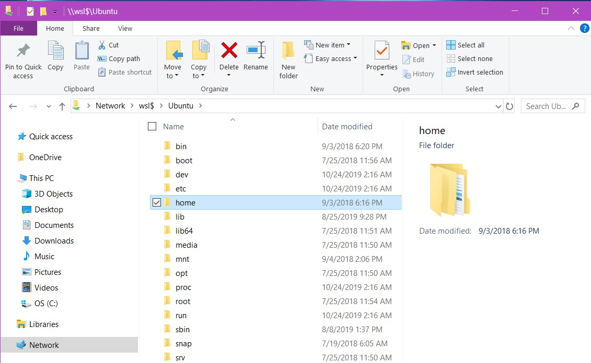

# Using Ubuntu on Windows 10 with WSL.  

Microsoft Launched Windows Subsystem for Linux a few years back. 
So now when you are on a Windows 10 laptop, you also have full access to the Ubuntu terminal on your Windows laptop! 
It's easy to install and fully compatible with Windows software, even File Explorer.  Follow the very detailed blog by Michael Treat.

#### Link to detailed blog on using WSL Ubuntu on Windows 10 machine.  

https://github.com/michaeltreat/Windows-Subsystem-For-Linux-Setup-Guide  

  
#### Images of using Windows File Explorer to view Ubuntu files.  

 - Desktop shortcut for Ubuntu.  
     

     
 - Create a shortcut and set "Target" as "\\\wsl$\Ubuntu".  
     

   
 - Open Ubuntu files using Windows File Explorer.   
       

   
 - You can also open Ubuntu text files with the built-in **Notepad**.  

#### Linux Commands Cheatsheet  

[Linux cheatsheet](davechild_linux-command-line.pdf)  
https://www.cheatography.com/davechild/cheat-sheets/linux-command-line/pdf/  

#### The best text editor for beginners using Ubuntu is Nano.  

https://www.hostinger.com/tutorials/how-to-install-and-use-nano-text-editor  

 - Install nano (you may need your password)   
   ```sudo apt-get install nano ```  
   
 - To create a newfile and start typing   
   ```nano newfile.txt``` ENTER key  

 - To edit existing file   
   ```nano myfile.txt``` ENTER key   
 
 - Control+s (save), Control+x (exit)  

#### Setting up virtual environmnet using Anaconda. 
 - [Conda Cheatsheet](conda-cheatsheet.pdf)

#### Starting Jupyter Notebook from Ubuntu without Firefox, copy URL to Chrome installed on Windows side.  

 * In case Github renderer for Jupyter Notebook fails, copy URL to nbviewer online to show the notebook.  
 
    https://nbviewer.jupyter.org/  
    https://nbviewer.jupyter.org/github/WomensCodingCircle/getting-started/blob/master/WSL-Ubuntu/matplotlib-2d-only.ipynb  
    https://nbviewer.jupyter.org/github/WomensCodingCircle/getting-started/blob/master/WSL-Ubuntu/matplotlib-3d-projection-v3.ipynb  
    
    Updated 10/24/2019.   
    **To show tomorrow at WCC Booth - Janelia Fall Fair** 10/25/2019 11:30 AM to 1:00 PM. -- DONE.  
    
-- Jennifer Yoon, Updated on 10/24/2019 --  

\-------------------------------------------  

#### Jennifer To Add Later:  

 1. Linux command, delete folder and all items without individual yes/no prompt.  
 1. Linux command, create alias for C:\mywork folder and save to permanent bash rc file.  
 
 1. Add Github instructions - Maybe under Git folder??  
    a. Simple commiting to user's own Github account repo.  
    b. Syncing with someone else's public Github account repo.  
       Add upstream to your machine, git pull upstream master.   
    c. Contribution to Open Source Github repo using FORK and upstream remote.  
       **First get them to sign up for Hactoberfest 2019**
       https://hacktoberfest.digitalocean.com/  
        - Use WCC getting-started repo to add pull-requests. 
        - Me - setup alert - Monitor and Merge them later.  
        
    d. Sign into user's Github account, Goto WCC account, Git Fork WCC getting-started repo.
       From user's laptop, git clone <User's Forked URL.git>
       From user's laptop, git remote add upstream <WCC getting-started repo.git>.  
       From user's laptop, to sync new changes as WCC Github.  
        - Make sure you are on "master" branch.  
        -  git checkout master. 
        -  git pull upstream master
       From user's laptop, git branch <new-feature>.  
        - git push origin new-feature. 
       Create Pull Request from user's own Github forked repo, on new-feature branch.  
 

    
